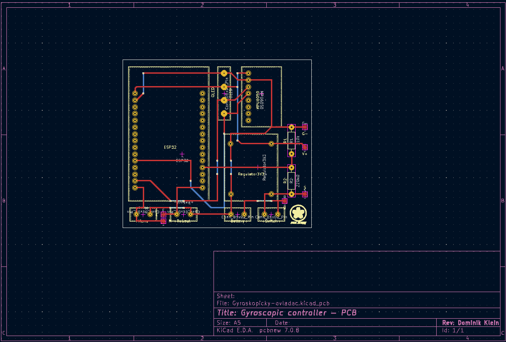

# Gyroscopic Controller

Gyroskopický ovladač postavený na mikrokontroléru **ESP32**. Tento projekt umožňuje snadné ovládání zařízení (např. her, robotů nebo dronů) pomocí pohybu ruky nebo zařízení díky vestavěnému gyroskopu a akcelerometru.

## Funkce
- **Detekce pohybu**: Real-time čtení dat z gyroskopu pro detekci rotace a akcelerace.
- **Bezdrátové připojení**: Podpora Wi-Fi a Bluetooth přes ESP32 pro snadnou integraci s aplikacemi.
- **Snadná konfigurace**: Použití Arduino IDE nebo PlatformIO pro rychlý vývoj.
- **Open-source hardware**: Kompatibilní s běžnými senzory jako MPU6050 nebo LSM6DS3 (upravte podle vašeho setupu).

## Diagramy a schémata

### Schéma zapojení (PNG)
Zde je schéma zapojení ESP32 s gyroskopickým senzorem MPU6050:

### Schéma PCB zapojení (PNG)
Zde je schéma PCB zapojení ESP32 s gyroskopickým senzorem MPU6050:

## Požadavky
- **Hardware**:
  - ESP32 development board (např. ESP32-WROOM-32).
  - Gyroskopický senzor (např. MPU6050 připojený přes I2C).
  - Jumper wires a breadboard pro prototypování.
- **Software**:
  - Arduino IDE (verze 2.0+) s ESP32 board support.
  - Knihovny: `Wire` (pro I2C), `MPU6050` (pokud používáte tento senzor) – instalujte přes Library Manager.

## Instalace
1. Nainstalujte Arduino IDE z [oficiálního webu](https://www.arduino.cc/en/software).
2. Přidejte podporu pro ESP32: V IDE jděte do **File > Preferences**, přidejte URL `https://raw.githubusercontent.com/espressif/arduino-esp32/gh-pages/package_esp32_index.json` do Additional Board Manager URLs a nainstalujte "esp32" z Board Manager.
3. Stáhněte si tento repozitář: `git clone https://github.com/Pito126/Gyroscopic-controller.git`.
4. Otevřete soubory `.ino` v Arduino IDE.
5. Nahrajte kód na ESP32 přes USB.

## Použití
1. Připojte gyroskopický senzor k ESP32 (příklad pro MPU6050):
   - VCC → 3.3V
   - GND → GND
   - SCL → GPIO 22
   - SDA → GPIO 21
2. Nahrajte sketch (příklad v `src/main.ino` – upravte podle vašeho kódu).
3. Otevřete Serial Monitor (115200 baud) pro sledování dat pohybu.
4. Pro bezdrátové ovládání: Připojte se k Wi-Fi síti ESP32 a použijte app (např. Blynk nebo vlastní mobilní app).

Příklad výstupu v Serial Monitoru:
